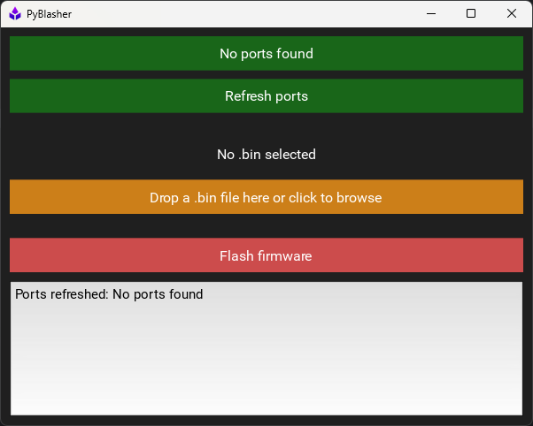

# pyblasher


Python based firmware flash and utility tool for
the [`momentum_pcb`](https://github.com/scalpelspace/momentum_pcb)
running [`momentum`](https://github.com/scalpelspace/momentum) firmware.

---

<details markdown="1">
  <summary>Table of Contents</summary>

<!-- TOC -->
* [pyblasher](#pyblasher)
  * [1 Overview](#1-overview)
    * [1.1 PyBlasher Graphical User Interface (GUI)](#11-pyblasher-graphical-user-interface-gui)
    * [1.2 PyBlasher Command Line Interface (CLI)](#12-pyblasher-command-line-interface-cli)
  * [2 Flashing Firmware](#2-flashing-firmware)
    * [2.1 UART Bootloader (USB-C)](#21-uart-bootloader-usb-c)
    * [2.2 SWD (TC2050)](#22-swd-tc2050)
    * [2.3 Manual Port Finding](#23-manual-port-finding)
  * [3 Dev Notes](#3-dev-notes)
    * [3.1 Deprecated PyInstaller Workflow](#31-deprecated-pyinstaller-workflow)
    * [3.2 PyInstaller Build](#32-pyinstaller-build)
      * [3.2.1 PyInstaller single file executable](#321-pyinstaller-single-file-executable)
      * [3.2.2 Inno Setup](#322-inno-setup)
<!-- TOC -->

</details>

---

## 1 Overview

### 1.1 PyBlasher Graphical User Interface (GUI)

PyBlasher runs in GUI mode by default.



### 1.2 PyBlasher Command Line Interface (CLI)

To manually run the CLI run use the `-c` or `--cli` flag.

```shell
python3 main.py --cli  # py instead of "python3" for Windows.
```

---

## 2 Flashing Firmware

3 methods of firmware flashing:

1. UART Bootloader via USB-C (Handsfree programming).
2. UART Bootloader via USB-C (Manual BOOT0 control).
3. SWD via TC2050.

### 2.1 UART Bootloader (USB-C)

There are 2 primary operating modes that affect USB-C firmware flashing:

1. **Default:** Handsfree programming.
2. **Modified:** Manual BOOT0 control.
    - `BOOT0 DTR bridge` cut/open for custom serial access.
    - For users using the second modified option will have additional steps,
      format shown below:
      > 1. _**For modified boards:**_ Example step only required for Manual
           BOOT0 control.

**Steps:**

1. If not done so already, download the Silicon
   Labs's [VCP CP210x USB to UART Bridge VCP Drivers](https://www.silabs.com/developer-tools/usb-to-uart-bridge-vcp-drivers).
2. _**For modified boards:**_ Short the `BOOT0 jumper` to raise BOOT0.
3. Connect your desktop computer to the Momentum USB-C.
4. Run pyBlasher.
5. pyBlasher should find the connected port automatically at the top.
    1. `COMxx` for Windows.
    2. `/dev/tty.usbserial-*` for macOS.
    3. `/dev/ttyUSB*` for Linux.

    - **If not found**, reconnect the Momentum USB-C and click the
      `Refresh ports` button.
    - If there is more than 1 board connected, you can click the top button
      and cycle through the port options.
6. Drag and drop the firmware `.bin` file or browse manually.
7. Click the `Flash firmware` button.
    - Firmware flashing will begin, the `UART RX` and `UART TX` leds should
      flash throughout the process.
8. Upon completion of flashing, the Momentum dev board will auto reset.
9. _**For modified boards:**_ Re-open the `BOOT0 jumper` and push the RESET
   button (short NRST to ground) to begin running the firmware.

### 2.2 SWD (TC2050)

1. Using an STM32 SWD flash tool (ie, ST-Link) connect to the TV2050 connector.
2. Flash/debug firmware with an SWD firmware flash setup (ie,
   STM32CubeProgrammer).

### 2.3 Manual Port Finding

**Windows:**

1. Open Device Manager.
2. Under `Ports (COM & LPT)` find the `COMx` port named something along the
   lines of `Silicon Labs CP210x USB to UART Bridge (COMx)`.

**macOS:** Open a terminal and enter the following command:

```shell
ls /dev/tty.* /dev/cu.*
```

- The expected name is similar to `/dev/tty.usbserial-*`.

**Linux:** Open a terminal and enter the following command:

```shell
dmesg | grep tty
````

- The expected name is `/dev/ttyUSB*`.

---

## 3 Dev Notes

### 3.1 Deprecated PyInstaller Workflow

The PyInstaller macOS, Windows, Linux builds workflow is saved
in [docs/pyinstaller.yaml](docs/pyinstaller.yaml) for reference.

- Discontinued use due to fatal error on Windows build related to Kivy and
  OpenGL versions, see
  issue [#2](https://github.com/scalpelspace/pyblasher/issues/2).

The badge markdown would be as follows:

```

```

### 3.2 PyInstaller Build

> Based on YouTube:
> [Convert GUI App to Real Program - Python to exe to setup wizard](https://youtu.be/p3tSLatmGvU)
> by [PythonSimplified](https://www.youtube.com/@PythonSimplified).

#### 3.2.1 PyInstaller single file executable

```shell
pyinstaller --name pyBlasher --onefile --windowed --icon=assets/icon.ico main.py
```

#### 3.2.2 Inno Setup

Setup file compiled via: [Inno Setup](https://jrsoftware.org/isdl.php).
